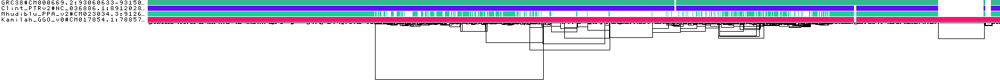
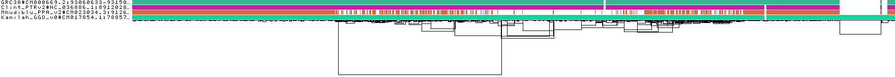
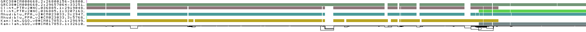

# Primate Evolution

The goal of this workflow is to perform comparative evolutionary analyses on several priamte genomes. Specifically, we will be exploring two loci that are of interest to primate immunity (SAMD9 and HLA). A self-contained Snakemake file and configfile are also included for reference. These use Singularity to run the docker image of pggb.   

## Data collection

```
"assemblies":{
	"GRC38":{
		"genbank_accession":"GCA_000001405.28",
		"species":"human",
		"fn_fna":"GCA_000001405.28_GRCh38.p13_genomic.fna.gz",
		"fn_ftp":"https://ftp.ncbi.nlm.nih.gov/genomes/all/GCA/000/001/405/GCA_000001405.28_GRCh38.p13/GCA_000001405.28_GRCh38.p13_genomic.fna.gz",
	},
	"Clint_PTRv2":{
		"genbank_accession":"GCA_002880755.3",
		"species":"chimp",
		"fn_fna":"GCF_002880755.1_Clint_PTRv2_genomic.fna.gz",
		"fn_ftp":"https://ftp.ncbi.nlm.nih.gov/genomes/all/GCF/002/880/755/GCF_002880755.1_Clint_PTRv2/GCF_002880755.1_Clint_PTRv2_genomic.fna.gz"
	},
	"Mhudiblu_PPA_v2":{
		"genbank_accession":"GCA_013052645.3",
		"species":"bornean_orangutan",
		"fn_fna":"GCA_013052645.3_Mhudiblu_PPA_v2_genomic.fna.gz",
		"fn_ftp":"https://ftp.ncbi.nlm.nih.gov/genomes/all/GCA/013/052/645/GCA_013052645.3_Mhudiblu_PPA_v2/GCA_013052645.3_Mhudiblu_PPA_v2_genomic.fna.gz"
	},
	"Kamilah_GGO_v0":{
		"genbank_accession":"GCA_008122165.1",
		"species":"gorilla",
		"fn_fna":"GCA_008122165.1_Kamilah_GGO_v0_genomic.fna.gz",
		"fn_ftp":"https://ftp.ncbi.nlm.nih.gov/genomes/all/GCA/008/122/165/GCA_008122165.1_Kamilah_GGO_v0/GCA_008122165.1_Kamilah_GGO_v0_genomic.fna.gz"
	},
}
```

...


## Pangenome Sequence Naming
...


## Sequence partitioning
...


## Divergence estimation
...


## Pangenome graph building
...


## Graph statistics
...


## Analyses



